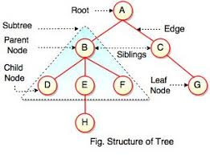
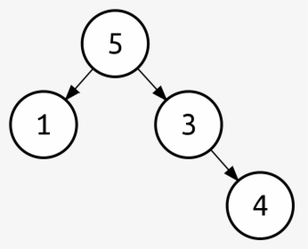
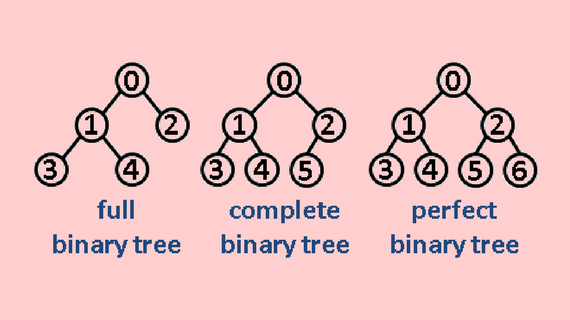

**TREE DATA STRUCTURE IN DETAIL**

- >**
Tree is an efficient way of storing and organizing data that is naturally hierachical.
**
- >**
Tree data structure can be defined as collection of entities called nodes linked together to simulate a hierarchy.
**
- >**
Tree is a non-linear data structure. its a hierarchycal structure.
**
- >**
Each node contains some data & data can be any type.
**

- Some Points / Definitaion : 
     1. **Root:** The topmost node is called Root of the tree.
     2. **Parent-Children:** Each node may contain link or reference to some other node called its Children & the node itself           is the Parent.
     3. **Sibling:** Children of same parent are called Sibling.
     4. **Leaf Node:** Any node that does not have a child called Leaf Node.
     5. **Ancestor & Descendent:** If we can go from node A to node B then A is ancestor of B. B is discendent of A.

- Properties of Tree:
     1. Recursive Data Structure.
     2. Tree with n nodes can have at most n-1 edges & may be 0 edges.
         if n-1 then it is fully connected tree.
         below n-1 it is a forest.
     3. Depth & Height: 
        depth of X = lengrh of path from root to X or no. of edges from root to X. 
        height of X = No. of edges in longest path from X to leaf. 
        height of Tree = Height of Root Node.
 
**Resource:**
1. Data structures: Introduction to Trees. 
[https://www.youtube.com/watch?v=qH6yxkw0u78&list=PL2_aWCzGMAwI3W_JlcBbtYTwiQSsOTa6P&index=25](url)
-----------------------------------------------------------------------------------------------------------------------------
**Binary Tree**
- Each node in the tree can have at most two children (0/1/2). a tree with only one node is also a binary tree.

- **Strict/Proper/Full binary tree:** each node can have either 0 or 2 children.
- **Complete Binary Tree:** All levels except possibly the last are completely filled & all nodes are left as possible.
- **perfect binary tree:** All levels are completely filled.
- **Maximum Number of nodes at level i is 2^i**
- **Maximum No. of nodes in a tree with height h**  = 2^0 + 2^1 + .... + 2^h 
                                                   = 2^(h+1) - 1 
                                                   = 2^(no. of levels) - 1 
- **Height of a complete binary tree h is:** floor(log n).  as, n = 2^(h+1) -1;
- **Balance binary tree:** Difference between height of left & right subtree for every node is not more than k(normally k = 1).
- **So, Complexity of dense/perfect/complete/balance binary tree is:** O(log n).
- **for parse tree complexity will be:** O(n-1) or O(n).
- **Height:** No. of edges in longest path from root to leaf.
- **Empty Tree:** Tree with no node. its height is -1. 
- **Height of a tree with one node is 0.

**Implementation**
- Dinamucally created nodes like linked list.
- Using array. (Normally used to implement Heap) 
  for node at index i, 
  left child index is: 2*i + 1 
  right child index is: 2*i + 2

**Resource:**
1. Data structures: Binary Tree. 
[https://www.youtube.com/watch?v=H5JubkIy_p8&list=PL2_aWCzGMAwI3W_JlcBbtYTwiQSsOTa6P&index=26](url)

---------------------------------------------------------------------------------------------------------------------------
**Binary Search Tree**
 is a node-based binary tree data structure which has the following properties:

- The left subtree of a node contains only nodes with keys lesser than the node’s key.
- The right subtree of a node contains only nodes with keys greater than the node’s key.
- The left and right subtree each must also be a binary search tree.

- Complexity:

     |Algorithm|Average	|Worst case|
     |---------|:--------|:--------:|
     |Space    |O(n)	|O(n)      |
     |Search	|O(log n)	|O(n)      |
     |Insert	|O(log n)	|O(n)      |
     |Delete	|O(log n)	|O(n)      |
     
- Comparison with Array & Linked list:

     |Algorithm|Array(Unsorted)|Array(sorted)|Linked list|BST(Balanced)|
     |---------|:--------------|:------------|:----------|:-----------:|
     |Search	|O(n)	      |O(log n)     |O(n)       |O(log n)     |
     |Insert	|O(1)	      |O(n)         |O(1)       |O(log n)     |
     |Delete	|O(n)	      |O(n)         |O(n)       |O(log n)     |
